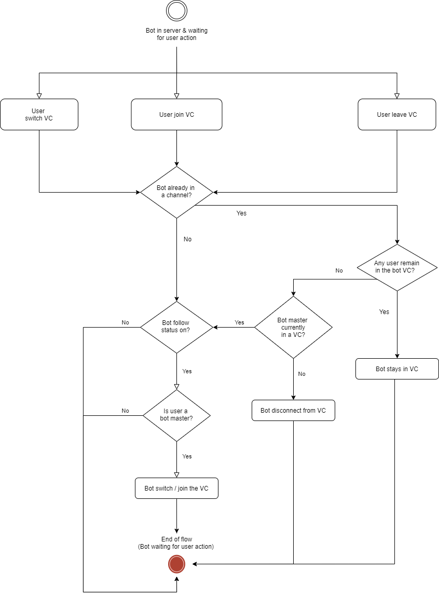

# bot-kurosaki

A small 1month project building using Node JS, a Discord music bot that supports YouTube, SoundCloud & Spotify tracks and playlists. Feel free to fork it and use it to build your own Discord bot. It also comes with an automated Voice Channel user-following behaviour. Which you can set the master guild member to the bot and it will follow the member from one Voice Channel to another!

### Key Features
- SoundCloud, YouTube (Mix  Playlist included) & Spotify supports
- Discord.js V13, slash commands features, separate events, slash commands and buttons handlers management
- Essential music player manipulation commands
  - **Play** `Play a track name/url or playlist url`
  - **Pause** `Pause the player`
  - **Clear** `Clear all tracks in queue except the current playing track`
  - **filter set/clear** `Set filters to/clear filters for all tracks in queue - filters include Vaporwave, Earrape, 8D & Nightcore`
  - **Nowplaying** `Show current playing track and duration bar`
  - **Queue** `Show tracks in the queue with pagination applied`
  - **Skip** `Skip current track in queue`
  - **Skipto** `Skip to specific track in queue`
  - **Stop** `Stop player entirely and cleat the queue`
  - **Leave** `Bot will leave the voice channel`
  - **Shuffle** `Shuffle tracks in queue`
  - **Loop - track/queue/off** `Loop current track/queue or disable loop mode`
  
#### Automated bot user-following behaviour
This feature allow the bot to follow certain guild member to Voice Channel. If user swicth/leave/join voice channel, the bot will follow as well. When the bot is first invited a server, the bot by default will follow the user who invited the bot. 
The behaviour of the bot is illustrated by the **flow chart** below:  

